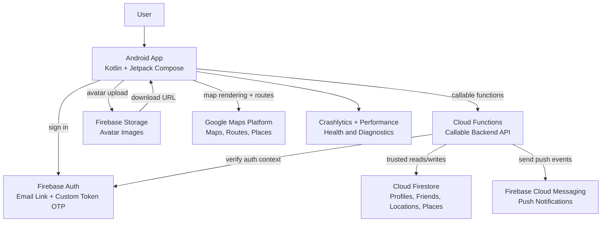
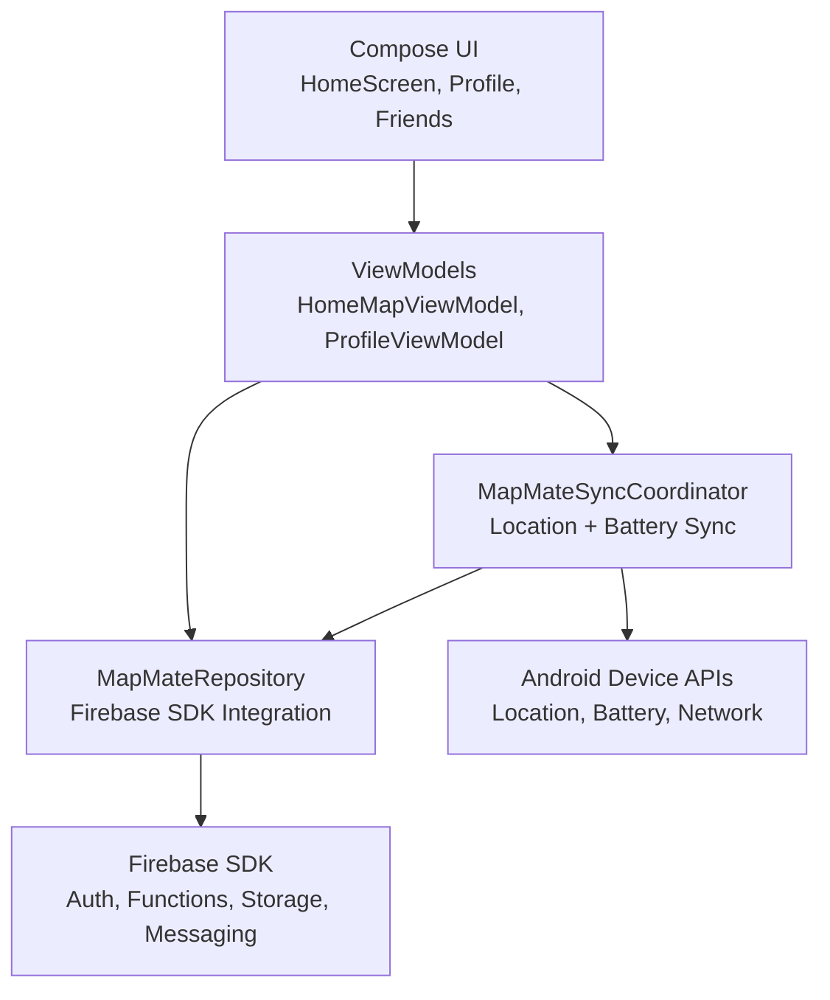
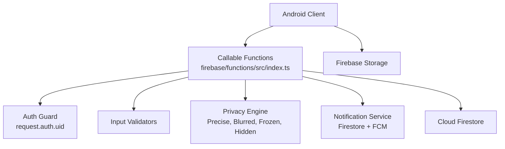
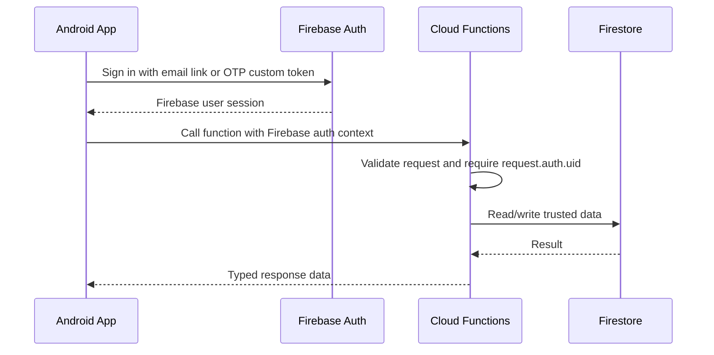
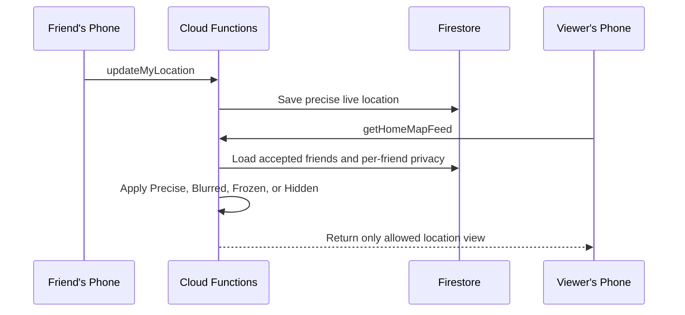
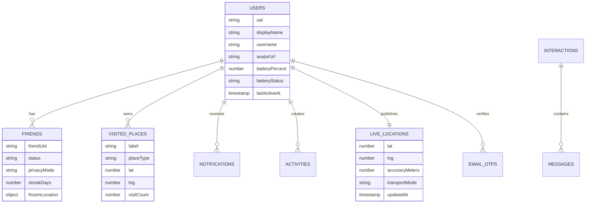
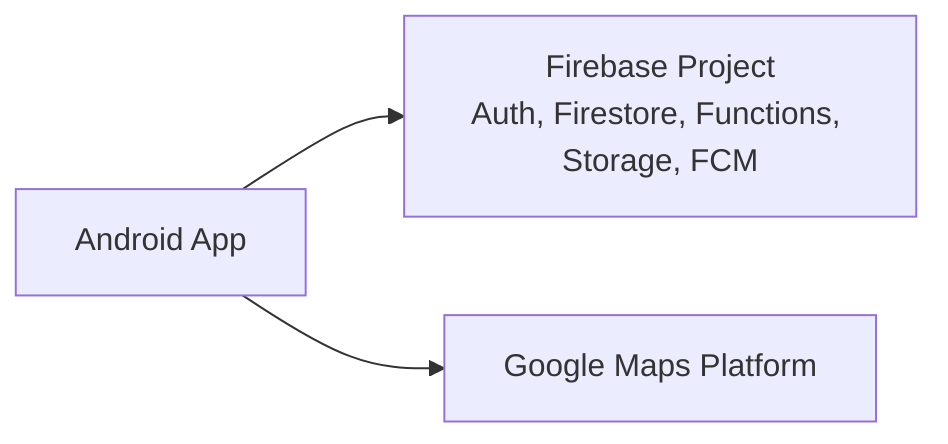
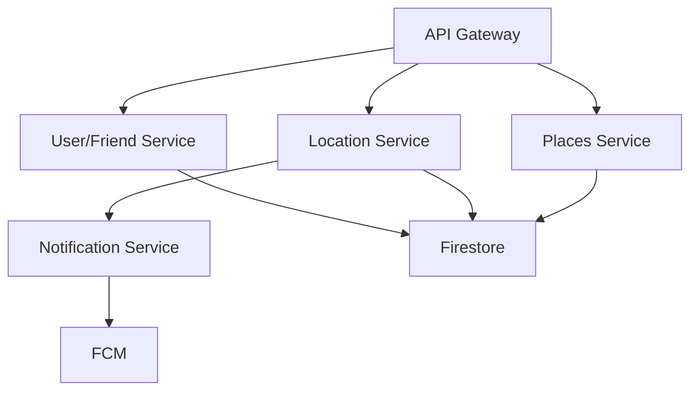

# MAPMATE Software Architecture

## Recommended Architecture Type

MAPMATE should use a **Firebase-backed serverless modular monolith**:

- **Android client:** Kotlin, Jetpack Compose, MVVM, repository layer.
- **Backend:** Firebase Cloud Functions callable APIs.
- **Data:** Cloud Firestore for app data and Firebase Storage for avatars.
- **Platform services:** Firebase Auth, Firebase Cloud Messaging, Crashlytics, Performance Monitoring, and Google Maps Platform.

This keeps the MVP simple to build and deploy while still putting the sensitive privacy and location logic on the backend.

## Why Not Microservices Yet

Microservices are useful when separate teams, data domains, or traffic patterns need independent deployment and scaling. MAPMATE is not there yet.

For this MVP, microservices would add extra cost and complexity:

- Multiple deployments instead of one Firebase project.
- Harder local testing and debugging.
- More network calls between services.
- More complicated data consistency for friendships, privacy, notifications, and live location.

Firebase Cloud Functions gives us the best middle ground: backend logic is modular by feature, but deployed as one serverless backend that can scale automatically.

## High-Level System Diagram

## Mobile App Architecture

The Android app should follow **MVVM with repository boundaries**.

### Mobile Layer Responsibilities

| Layer | Responsibility |
|---|---|
| UI | Render map, friend markers, privacy controls, profile and invite surfaces. |
| ViewModel | Hold screen state, loading state, errors, and user actions. |
| Repository | Call Firebase Functions, upload avatars to Storage, and map errors into app messages. |
| Sync Coordinator | Send active location every 3 seconds and battery status every 2 minutes. |
| Device APIs | Provide location, battery, connectivity, notifications, and background execution support. |

## Backend Architecture

Cloud Functions should stay organized as a **modular monolith** by feature area.

### Backend Module Responsibilities

| Module Area | Responsibility |
|---|---|
| Auth | Numeric email OTP, custom token creation, email-link support through Firebase Auth. |
| Profile | Create and update profile records, reserve usernames. |
| Friends | Send requests, accept, unfriend, block, and maintain per-friend privacy. |
| Location | Store live location and return only privacy-safe friend views. |
| Device | Store battery percentage and charging/low/full/normal state. |
| Notifications | Persist notifications and send FCM push messages. |
| Places | Record visited places and merge nearby repeat visits. |
| Scheduled Jobs | Detect off-grid friends when location has gone stale. |

## Core Request Flow

## Location And Privacy Flow

Location privacy must be enforced in Cloud Functions, not only in the app.

## Main Data Collections

## Callable API Surface

| Feature | Callable Function |
|---|---|
| Numeric OTP request | `requestEmailOtp` |
| Numeric OTP verify | `verifyEmailOtp` |
| Create profile | `createProfile` |
| Update profile | `updateProfile` |
| Search users | `searchUsers` |
| Friend request | `sendFriendRequest` |
| Accept friend | `acceptFriendRequest` |
| Unfriend | `unfriendUser` |
| Block user | `blockUser` |
| Update Ghost Mode | `updateFriendPrivacy` |
| Update location | `updateMyLocation` |
| Update battery | `updateBatteryStatus` |
| Register push token | `registerFcmToken` |
| Update notification settings | `updateNotificationSettings` |
| Home map feed | `getHomeMapFeed` |
| Send emoji | `sendEmoji` |
| Record visited place | `recordVisitedPlace` |
| Get visited places | `getVisitedPlaces` |
| Notifications | `getNotifications`, `markNotificationRead` |
| Recent activity | `getRecentActivities` |
| Off-grid detection | `detectOffGridFriends` scheduled job |

## Security Principles

- Android never reads another user's raw live location directly.
- Cloud Functions require `request.auth.uid` for protected operations.
- Ghost Mode transformation happens in Cloud Functions before data returns to the viewer.
- Firestore rules deny direct reads to sensitive collections like `liveLocations`.
- Storage rules allow users to upload only their own avatar files.
- Numeric OTP codes are hashed before storage.
- Firebase config files and local API keys stay out of Git.

## Deployment Shape

Recommended workflow:

| Task | Command |
|---|---|
| Build Android app | `./gradlew :app:assembleDebug` |
| Build functions | `cd firebase/functions && npm run build` |
| Run Firebase emulators | `cd firebase/functions && npm run serve` |
| Deploy backend rules and functions | `cd firebase/functions && npm run deploy` |

## Future Evolution

Only split into microservices after real usage shows a need for independent teams, data stores, or scaling profiles.

Do not start here. Treat this as a future option after product-market fit and real traffic.
