# MapMate — Final Merged Android App (CS3332)

**This is the final, runnable Android application for the MapMate group project.** It is a single
native Android app (Kotlin + Jetpack Compose) that **merges every team member's real module code**
into one product, built on the team's "NavX" visual design and the agreed
[merge strategy](../../../Documents/specs/2026-06-06-mapmate-merge-strategy.html) (native Android,
Firebase-backed, server-authoritative in production).

It builds with Gradle, installs on an Android emulator, and runs end-to-end. The UI is rebuilt in
Jetpack Compose to match the NavX design template **1:1** — bundled Syne + DM Sans fonts, the 5-item
bottom nav with the floating center button, the stylized route map, and all 12 screens. The
screenshots below are this app running on a Pixel 7 Pro emulator.

| Splash | Login | Verify (OTP) |
|---|---|---|
| 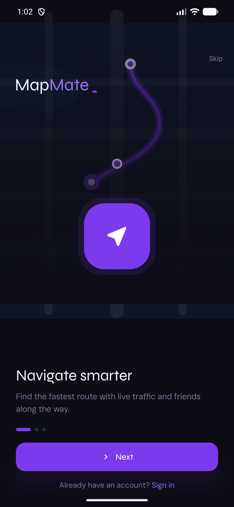 | 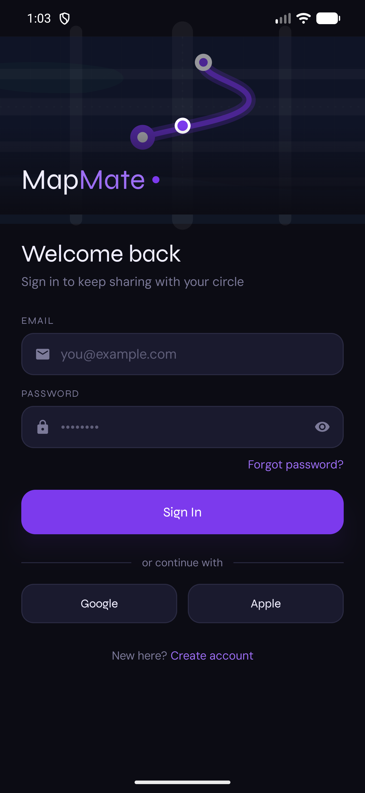 | 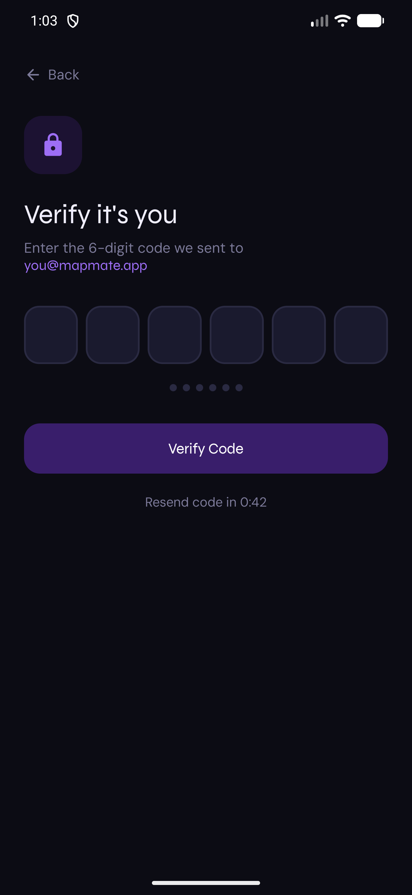 |

| Map (home) | Tap-a-friend privacy | Friends |
|---|---|---|
| 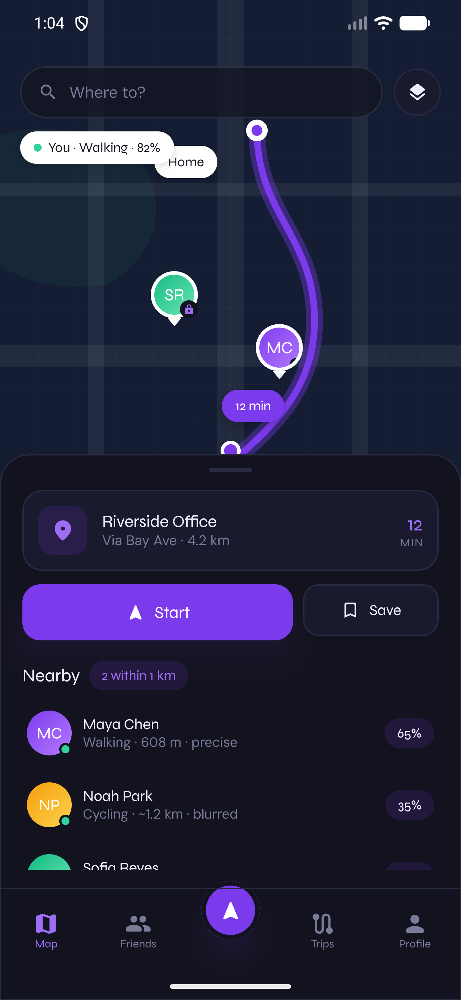 | 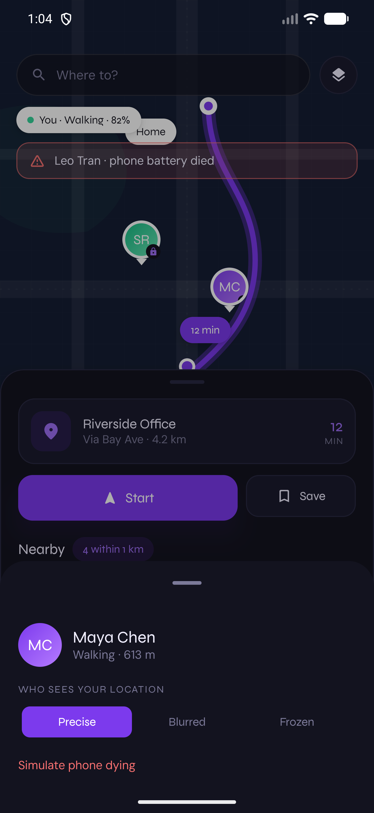 | 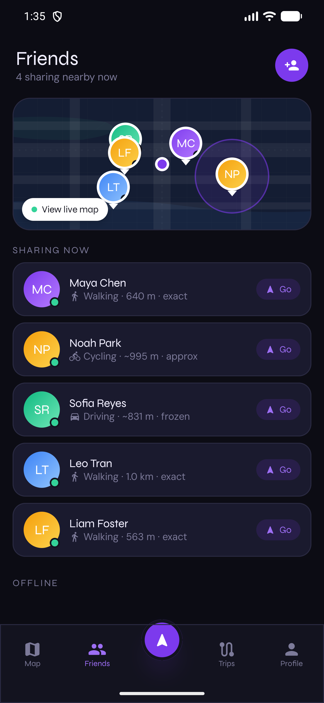 |

| Trips | Profile | Search |
|---|---|---|
| 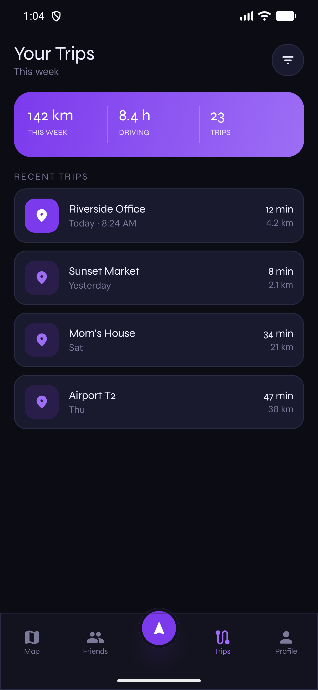 | 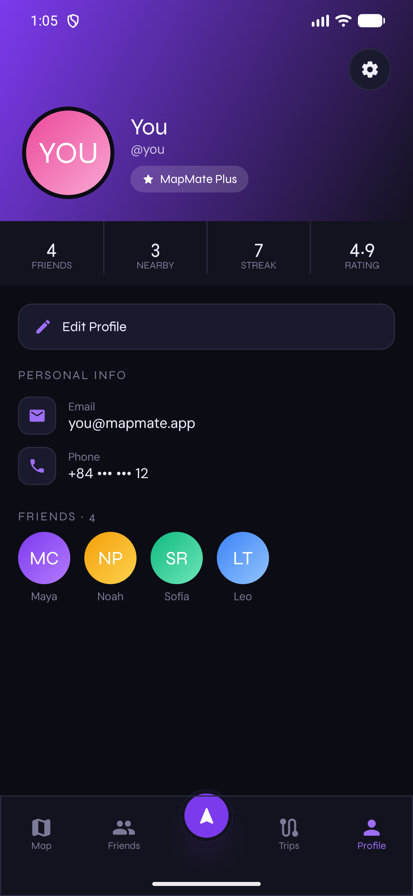 | 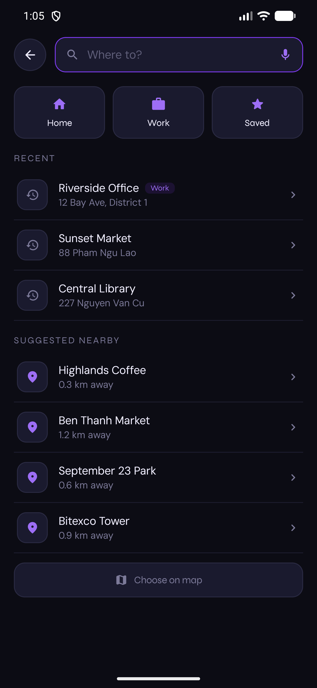 |

| Navigate | Settings (per-friend privacy) | Add Friend |
|---|---|---|
| 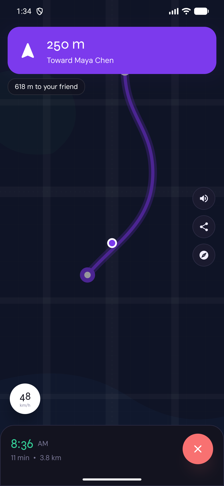 | 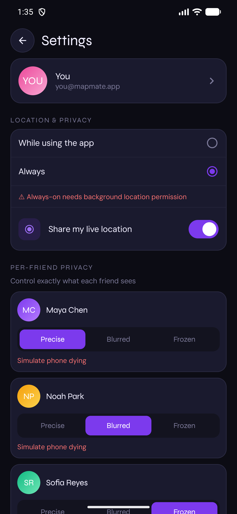 | 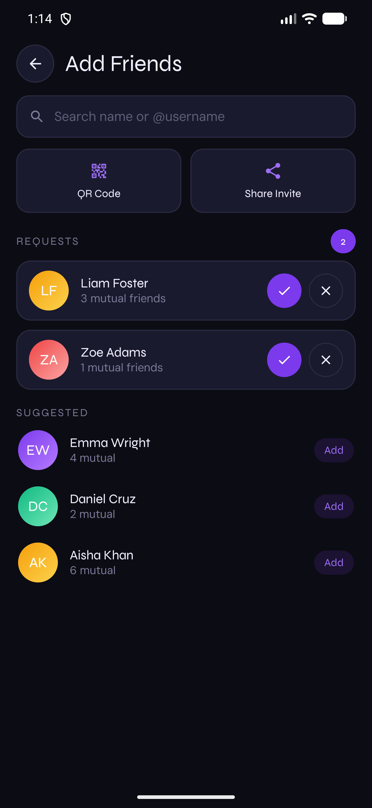 |

**Tap any friend** — on the map or in a list — to set their per-friend privacy (Precise / Blurred /
Frozen) from a bottom sheet, in addition to the Settings screen.

---

## What this is

Each of us built a separate piece of MapMate in a separate repo, in different stacks. This project
**combines all of them into one Android app** — keeping each person's original logic and language
(Kotlin), wired together behind the shared NavX design. Nothing here is a throwaway mock: the map you
see is driving **real** classifier, privacy, distance, and alert code written by the team.

## Who built what, and where it runs in the app

| Module | Owner(s) | Original repo | Lives in package | What you see in the app |
|---|---|---|---|---|
| **Profile / Auth / Friends** | Teo & Michael | `MapMate-ModuleA-Profile` | `com.mapmate.profile.*` | Login + OTP verify, friends list, profile, friend requests, streaks (clean-architecture use-cases + Firebase repositories) |
| **Real-time location / transport** | Mai Nam Khanh | `MapMate-Khanh-sfeature` | `com.mapmate.telemetry.*` | Live transport mode (Walking / Cycling / Driving) via `SpeedSmoother` + `TransportClassifier` (hysteresis state machine) |
| **Privacy / Device / Off-grid** | Tran Thanh Dat (Mike) | `mapmate-device-privacy` | `com.mapmate.privacy.*`, `com.mapmate.device.*` | Per-friend **Precise / Blurred / Frozen** rendering on the map, battery state, and the **Off-the-Grid** alert banner |
| **Distance / nearby** | Vu Tien Tue | `Nodejs-Distance-Calculation` | `com.mapmate.distance.*` | "N within 1 km" + per-friend distance (Haversine), computed from the **privacy-filtered** location |
| **Backbone + map UI + Firebase** | Tung (team lead) | `Wuewue/MapMate` (`New test/`) | `com.mapmate`, `com.mapmate.data.remote.*`, `com.mapmate.ui.*` | App shell, Cloud-Functions data layer, the home/map screen, navigation, theming |

The one piece that was not originally Kotlin — Tue's `distance.js` (Node.js) — was ported **1:1** to
Kotlin in `com.mapmate.distance.Distance`, preserving his Haversine algorithm exactly.

## How the merge actually works

`com.mapmate.demo.MapMateEngine` is the heart of the merge. On a 1.5-second tick it runs **every
member's real code together** on a seeded friend group:

```
simulated GPS → Khanh.SpeedSmoother → Khanh.TransportClassifier ─┐
                                                                  ├→ map pin + nearby row
Mike.PrivacyResolver(mode, snapshot) → Visibility ───────────────┤   (transport, distance, battery,
Tue.Distance.haversine(filtered coords) ─────────────────────────┤    privacy render)
Mike.AlertDetector(snapshot) → Off-the-Grid alert ───────────────┘
```

The integration rule from the spec is enforced: **distance is computed from the privacy-filtered
coordinate, never the real GPS point.** That's why blurred/frozen friends show an approximate `~`
distance on the map — their real position is never exposed to the viewer.

## Demo mode vs. real mode

The app ships with `BuildConfig.DEMO_MODE = true` so it **runs on a bare emulator with no live
backend** — the engine above feeds the UI seeded, live-updating data.

The **real Firebase data layer is fully present** (`com.mapmate.data.remote.MapMateRepository` →
Cloud Functions; Teo's `FirebaseRepositories` → Firestore + Auth). To switch to the real backend:

1. Drop a real `app/google-services.json` over the placeholder (project `mapmate-69a2e`).
2. Deploy the Cloud Functions in `firebase/functions/`.
3. Set `DEMO_MODE = false` in `app/build.gradle.kts`.

All API keys in this repo are **placeholders** (`app/google-services.json`, `local.properties`).

## Build & run

```bash
# from this directory (mapmate-android/)
./gradlew :app:assembleDebug                 # build the APK
# or open the folder in Android Studio and press Run

# install + launch on a running emulator:
adb install -r app/build/outputs/apk/debug/app-debug.apk
adb shell am start -n com.mapmate/.MainActivity
```

Requirements: Android Studio (or the SDK + an emulator), JDK 17. `local.properties` must point
`sdk.dir` at your Android SDK. **No Google Maps API key is needed** — the map is a stylized Compose
canvas (`com.mapmate.ui.map.StylizedMapCanvas`), not Google Maps, so it renders on any emulator.

- compileSdk 36 · minSdk 24 · Kotlin 2.2.21 · AGP 9.2.1 · Gradle 9.4.1 · Compose BOM 2025.10
- Firebase Auth / Firestore / Functions / Storage (BOM 34.14.0)

## What was re-homed during the merge (per the team strategy)

- **Khanh's telemetry storage** moved off Firebase Realtime Database onto **Firestore-only** (the
  agreed single data product). His classifier/smoother/battery logic is unchanged; the protobuf
  serializer and Realtime-DB writer were dropped in favour of the Firestore path.
- **Tue's distance** was ported from Node.js to Kotlin (same algorithm).
- **Three colliding `BatteryStatus` types and two `PrivacyMode` types** were kept in their owners'
  packages and mapped at the boundaries rather than force-merged, so no one's logic changed.

## Coding style

Glue and UI code follows the project's house comment style (lowercase, casual, sparse). Each member's
ported files keep their **original comments verbatim** — only `package`/`import` lines were changed.

## Project layout

```
mapmate-android/
├── app/src/main/java/com/mapmate/
│   ├── profile/      ← Teo & Michael (auth, friends, profile, Firebase)
│   ├── telemetry/    ← Khanh (speed smoother, transport classifier, battery)
│   ├── privacy/      ← Mike (PrivacyResolver, AlertDetector, Visibility)
│   ├── device/       ← Mike (DeviceSnapshot, BatteryStatus, Coordinates)
│   ├── distance/     ← Tue (Haversine, ported to Kotlin)
│   ├── data/remote/  ← Tung (Cloud Functions repository + canonical models)
│   ├── location/     ← Tung (FusedLocation sync coordinator)
│   ├── demo/         ← MapMateEngine — runs everyone's code together (the merge)
│   └── ui/           ← NavX design in Compose (theme, components, map, screens, nav)
└── firebase/         ← Tung (Firestore rules + Cloud Functions)
```
